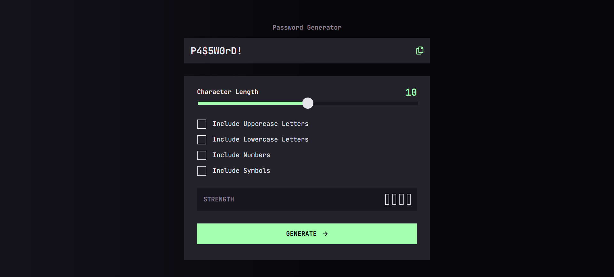

# Frontend Mentor - Solución de la aplicación para generar contraseñas

Esta es una solución al [desafío de la aplicación generadora de contraseñas en Frontend Mentor](https://www.frontendmentor.io/challenges/password-generator-app-Mr8CLycqjh). Los desafíos de Frontend Mentor te ayudan a mejorar tus habilidades de programación creando proyectos realistas.

## Tabla de contenido

- [Descripción general](#descripcion-general)
  - [Captura de pantalla](#captura-de-pantalla)
  - [Llevado a cabo con](#llevado-a-cabo-con)
  - [Lo que aprendí](#lo-que-aprendi)
  - [Autor](#autor)

## Descripción general

### Captura de pantalla

### Links
- [URL de la solución](https://www.frontendmentor.io/solutions/aplicacin-generadora-de-contraseas-con-javascript-vCz00tHpNu)
- [URL del sitio en vivo](https://braismarquez2025.github.io/password-generator-app/)

## Mi proceso

### Llevado a cabo con

- Marcado semántico HTML5
- Propiedades personalizadas de CSS
- Preprocesador SCSS
- Flexbox
- Javascript

### Lo que aprendí 
He aprendido a darle estilos a los inputs de tipo "slide", ya que algunos estilos entran en conflicto con los estilos por defecto del navegador. También me ha costado personalizar el checkbox, sobre todo a la hora de hacer click sobre el y que cambie su estilo. Mi forma de platearlo ha sido crear un elemento desde javascript y colocarlo por encima de la casilla vacía sobre la que el usuario pincha, no sé si es la mejor forma o me he complicado de más, cualquier punto de vista diferente se agradece! Por último, he tenido que pensar los condicionales para el apartado de la seguridad de la contraseña, ya que al principio no funcionaba bien.

### Autor 
- Usuario de Frontend - [@braismarquez2025](https://www.frontendmentor.io/profile/braismarquez2025)
- Gmail - braismarquez2003@gmail.com

